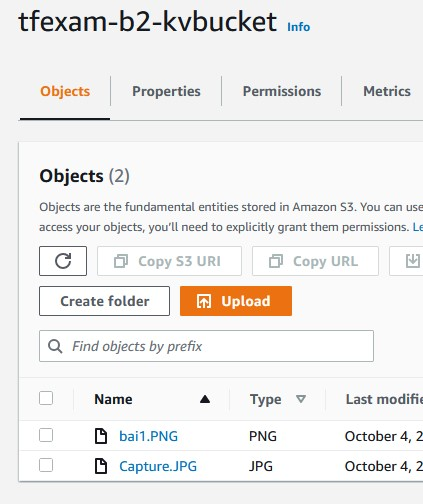

# Bầi kiểm tra 2

### Link: http://tfexam-b2.stawari.net

### Mô tả: 
    1. Terraform sẽ tạo 1 Role có quyền truy cập vào S3 từ Ec2: 
    2. Sau đó tạo 1 Ec2 attach role vào.
    3. Ec2 sẽ được attach Security Rule mở port SSH và HTTP
    4. Public Ip của Ec2 sẽ được gán vào domain: tfexam-b2.stawari.net thông qua route53 service
    5. File ./uploads3 sẽ được copy vào Ec2 vào khởi chạy mỗi khi khởi động bằng User Data

### Kết quả:
- Từ giao diẹn website có thể update file, và file đã được lưu trữ trên S3

