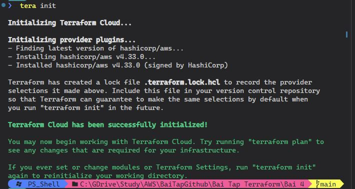
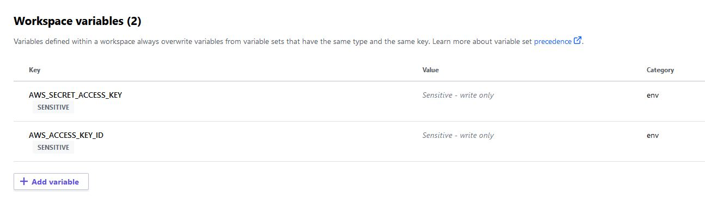
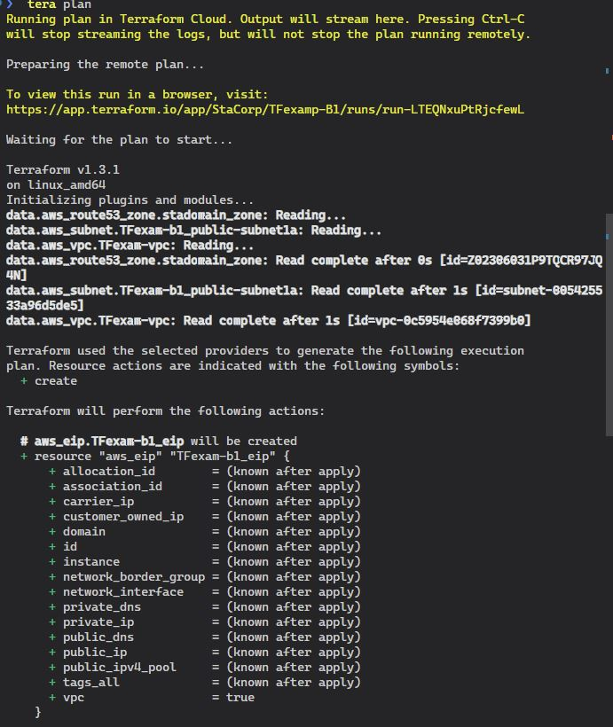
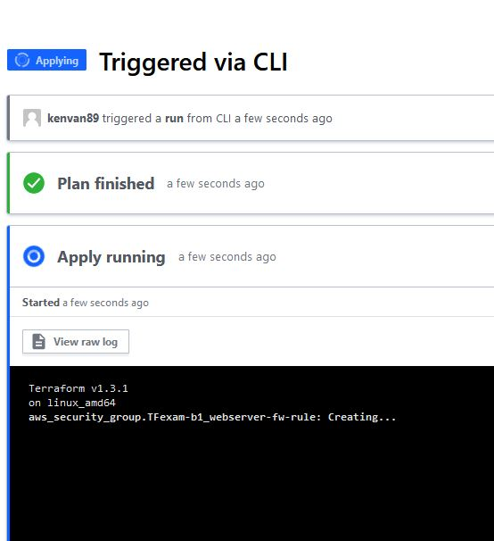
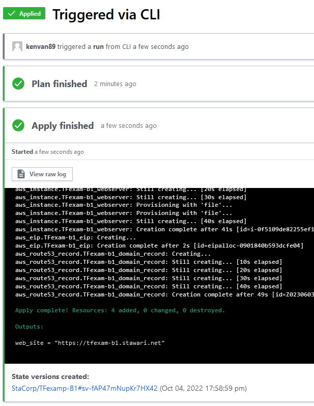
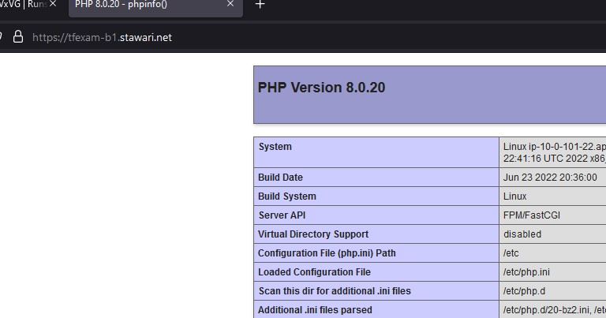

# Bài Kiểm Tra 4 Sử dụng TerraForm Cloud

### Sau khi login = lệnh terraform login, ta chạy lệnh init để có thể init trên Terraform Cloud

### Setup thêm 2 AWS Key để Terraform có thể access vào AWS 

### Terraform Plan SourceCode từ Bài 1 => Thành công

### Bắt đầu Apply và chờ kết quả 

### TerraForm Cloud apply xong

### Access website thành công 

