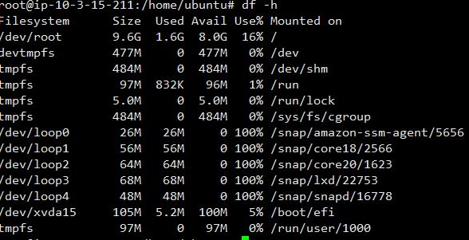
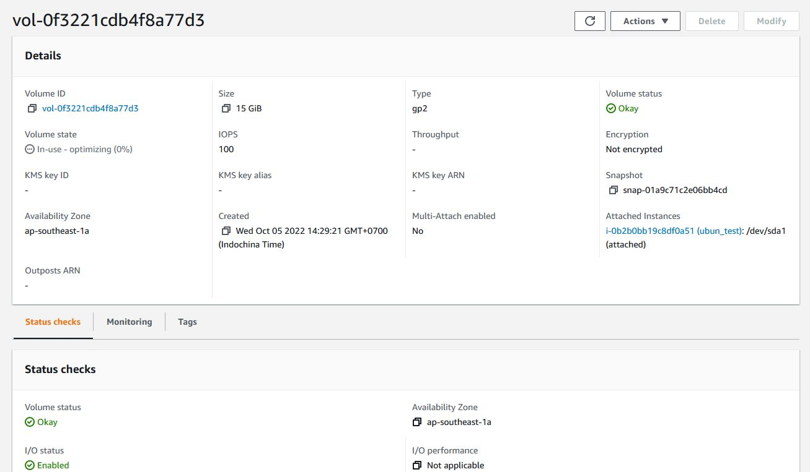
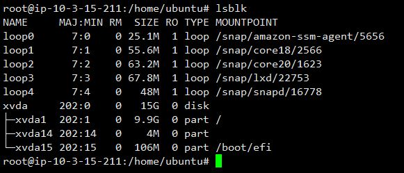
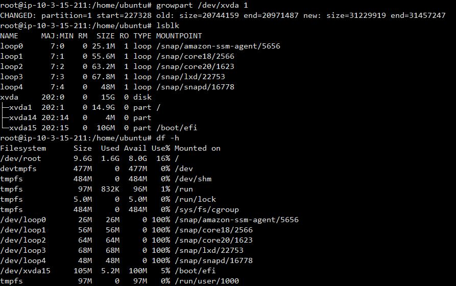
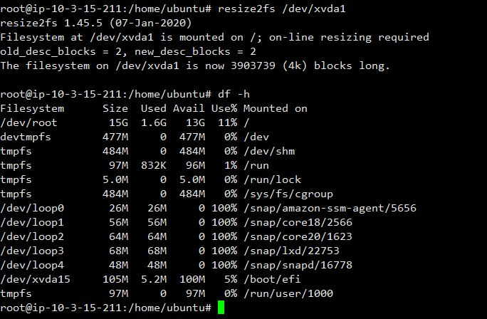

# Bài tập Extend EBS

### Đầu tiên ta kiểm tra dung lượng ổ đĩa với 10GB

## Bắt đầu Các bước extend

### 1 - Tăng dung lượng volume thông qua AWS Web Console

### 2 - Kiểm tra dung lượng tổng đã tăng trong Ec2

### 3 - Extend dung lượng bằng grow part

### 4 - Resize và kiểm tra kết quả => đã nâng lên thành 15GB

