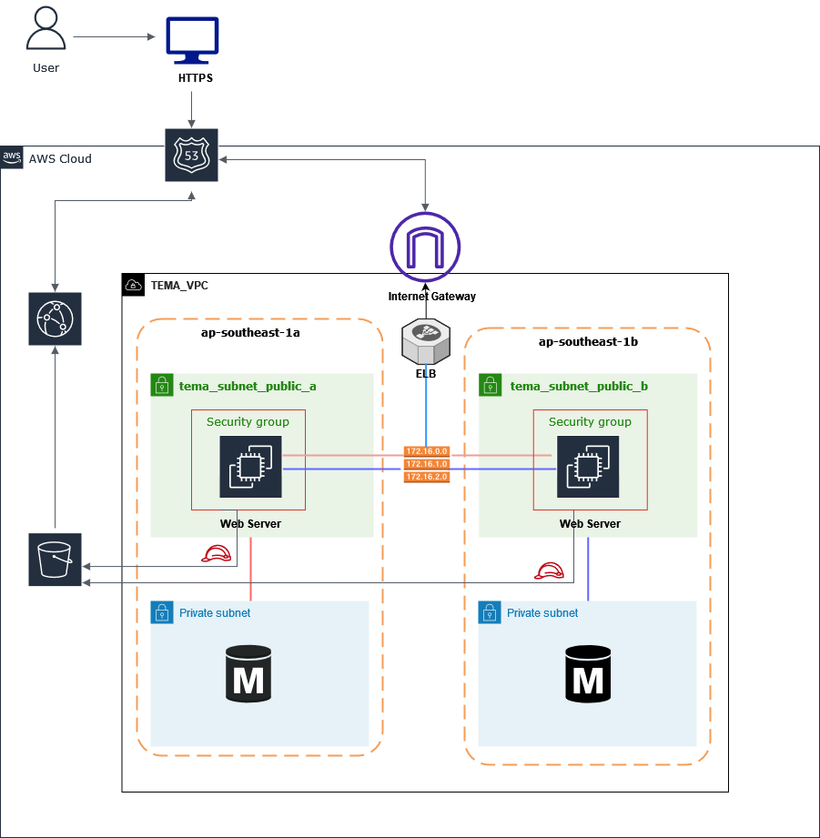

# Bầi kiểm tra Tạo Mô Hình Web LaraVel
Mô hình :

### Link Video: https://www.youtube.com/watch?v=RdbQSaG6gUE

### Mô tả: 
    Mô hình tạo  :
    -  Gồm 2 webserver (public_subnet), DB(private_subnet) ở 2 AZ khác nhau
    -  Thông qua ELB + Route53 để truy cập web
    -   S3 để lưu trữ file upload có thể truy cập thông qua CloudFont và EC2 thông qua IAmRole

### Kết quả:
- Có thể truy cập được bằng link như video đã nêu

