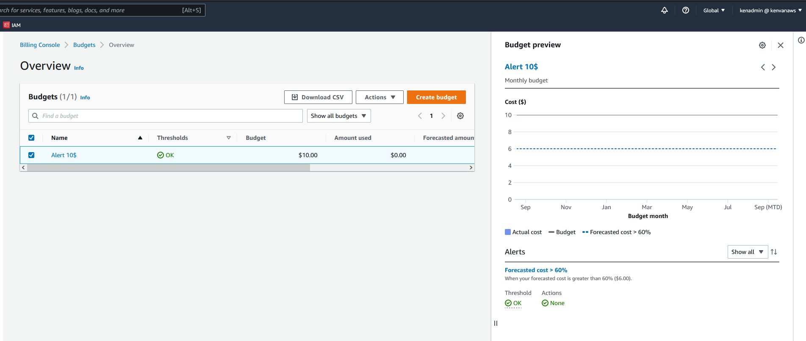
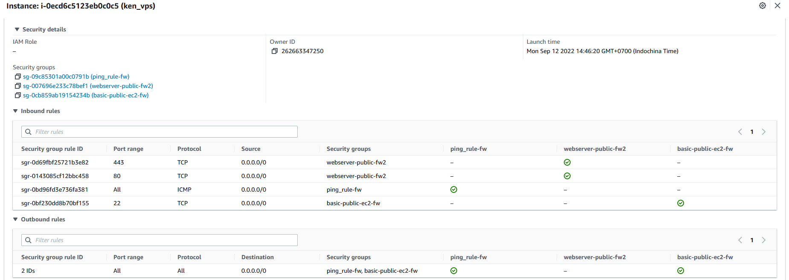
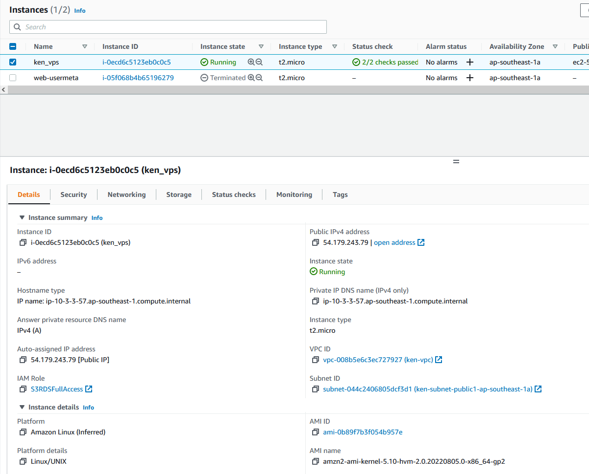
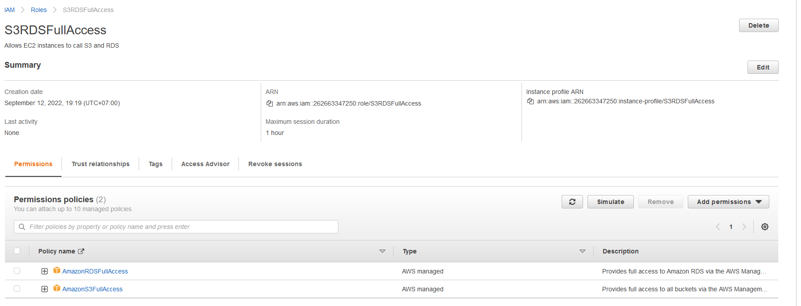
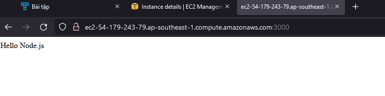

# AWSTECHMASTER - Bai tap Buoi 4

## Phần 1: Trắc nghiệm

- 1 - C
- 2 - D
- 3 - A
- 4 - A
- 5 - A
- 6 - A, B
- 7 - C
- 8 - D, E
- 9 - B
- 10 - D
- 11 - B
- 12 - A
- 13 - B
- 14 - C
- 15 - B, E
- 16 - A, B, D
- 17 - B

## Phần 2: Thực hành

### Bai 1 - Budget Alert

### Bai 2 - Ping to EC2

### Bai 3 - Create IAM Role

### Bai 4 - Deploy Node.js app

Link: http://ec2-54-179-243-79.ap-southeast-1.compute.amazonaws.com:3000/